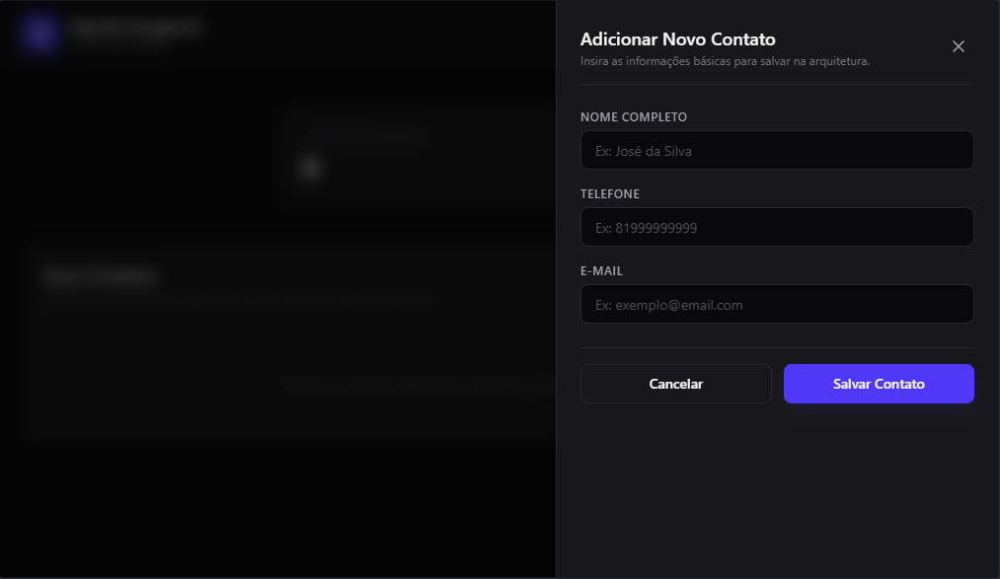
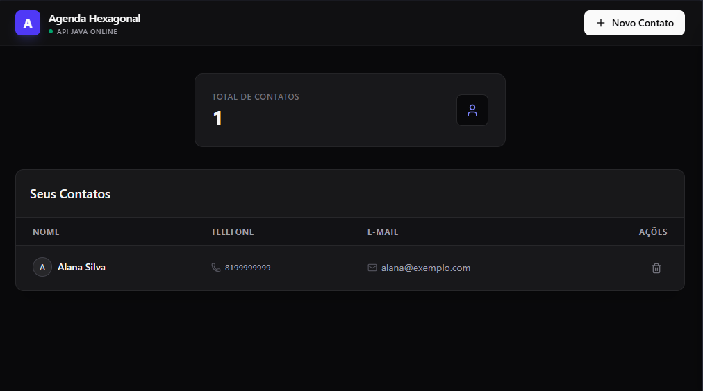

# 🎨 Agenda Telefônica Web — Front-end com React & TypeScript

Este repositório contém a interface web (Front-end) da **Agenda Telefônica**, projetada para oferecer uma experiência de usuário (UX) minimalista, fluida e de alta performance. O projeto foi construído utilizando **React.js** com a velocidade do **Vite**, totalmente tipado com **TypeScript** e estilizado com o moderno **Tailwind CSS v4**.

A aplicação funciona como um Single Page Application (SPA) de alta fidelidade visual, consumindo em tempo real os dados fornecidos por uma API REST em Java.

---

## 🎯 Recursos e Diferenciais da Interface

* **Visual Premium Dark Mode:** Layout minimalista escuro inspirado em designs modernos (como Vercel e Linear), utilizando tipografia limpa, bordas finas e contrastes sutis.
* **Painel Lateral Deslizante (Drawer):** Fluxo de cadastro de novos contatos através de uma gaveta lateral animada nativamente com Tailwind v4, sem dependências pesadas de animação de terceiros.
* **Tipagem Estrita com TypeScript:** Utilização de compiladores modernos configurados com `verbatimModuleSyntax`, garantindo que imports de tipos (`import type`) sejam explícitos, otimizando o build final.
* **Arquitetura de Consumo Limpa:** Chamadas HTTP centralizadas em uma camada isolada de serviços (`services/`), separando a lógica de comunicação com a API dos componentes visuais.

---

## 🛠️ Tecnologias e Bibliotecas Utilizadas

* **React.js 18+ & Vite:** Para um ecossistema de desenvolvimento e build ultra-rápido via Hot Module Replacement (HMR).
* **TypeScript:** Garantia de contratos de dados idênticos aos DTOs/Entidades do backend, gerando autocomplete e segurança no código.
* **Tailwind CSS v4:** Motor de estilização de última geração, utilizando compilação baseada no Vite para CSS nativo e otimizado.
* **Lucide React:** Conjunto de ícones vetoriais modernos e minimalistas.

---

## 📂 Estrutura de Pastas (Front-end Clean)

A estrutura do projeto foi organizada seguindo boas práticas de escalabilidade no React:

```text
src/
├── services/          # 🔌 Camada de Conexão: Requisições HTTP (Fetch/API)
│   └── api.ts         # Métodos listar, criar e deletar contatos
├── types/             # 🧠 Contratos: Interfaces e Tipagens do TypeScript
│   └── contato.ts     # Modelo do objeto Contato refletido do Backend
├── App.tsx            # 🎛️ Componente Principal: Controla estados (Drawer, contatos e loading)
├── index.css          # 🎨 Estilos Globais: Diretivas do Tailwind v4 e resets visuais
└── main.tsx           # 🚀 Inicializador do ciclo de vida do React

```

---

## ⚙️ Variáveis de Ambiente (Configuração de Produção)

Para que a interface funcione tanto localmente quanto na nuvem, o endpoint da API foi configurado de forma dinâmica. O projeto lê as configurações do arquivo `.env`:

```env
VITE_API_URL=http://localhost:8080/api/contatos

```

---

## 🚀 Como Executar o Projeto

1. Certifique-se de ter o **Node.js** instalado na sua máquina.
2. Abra a pasta `agenda-web` no seu terminal e instale as dependências:

```bash
npm install

```

3. Execute o servidor de desenvolvimento do Vite:

```bash
npm run dev

```

4. Acesse o endereço fornecido no terminal (geralmente `http://localhost:5173`) para ver o painel em execução.
*(Nota: Certifique-se de que a API Java do backend também está rodando para que os dados sejam carregados na tabela).*

---
